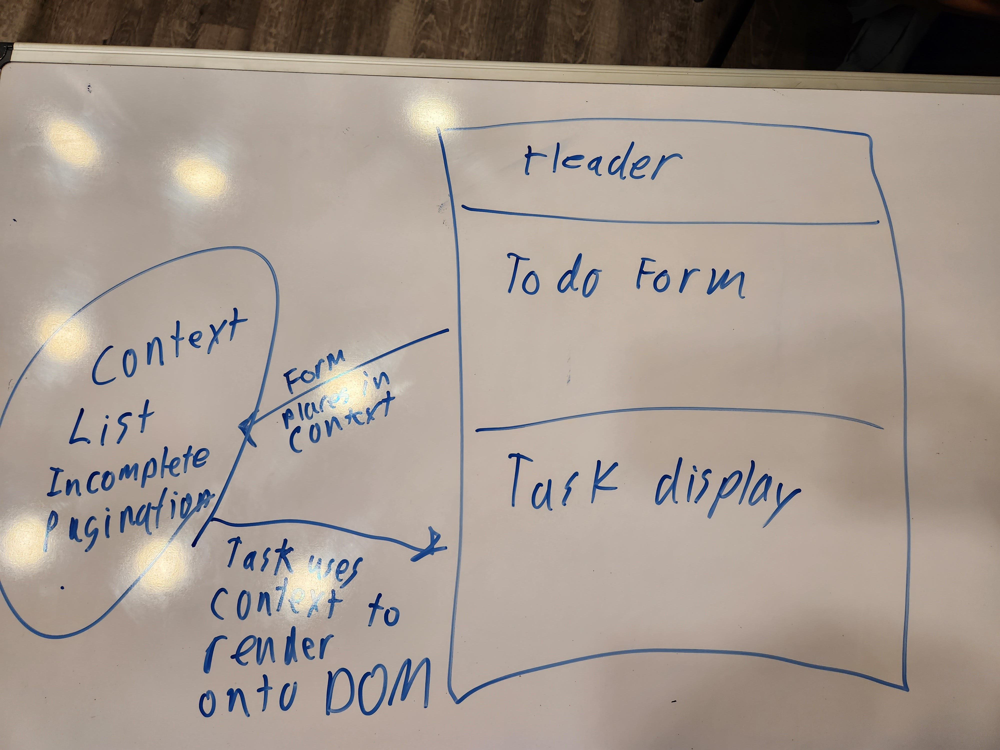

# todo-app  

## UML  

## Approach  

Modularized these components and added some styling from blueprint. Also added pagination to display only the first three tasks. I used context where applicable along with a couple of instances of use state.  

## Lab 32  

## Approach  

Implemented a settings drop down that controls pagination, alphabetical order sort, and hide/show completed tasks. Tried to get some tests running, but couldn't get them to run with the test command. Not sure why it isn't recognizing them, but it says that it doesn't detect any changes since the last commit even after a commit.  

## Lab 33  

## Approach  

Added a auth context that prevents people from access the to do list without first logging in. Once they are logged in they can only read, write, update, and delete based on the role that they are assigned. User's token is saved as a cookie and verified on page reload. I'm still having trouble with the testing. I'll be asking for help on it when we come back on Monday.
